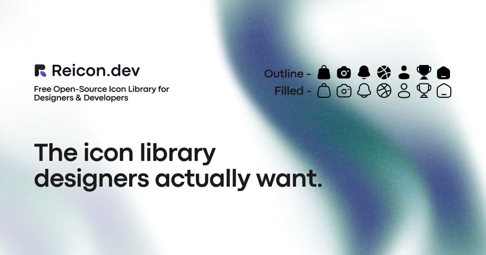
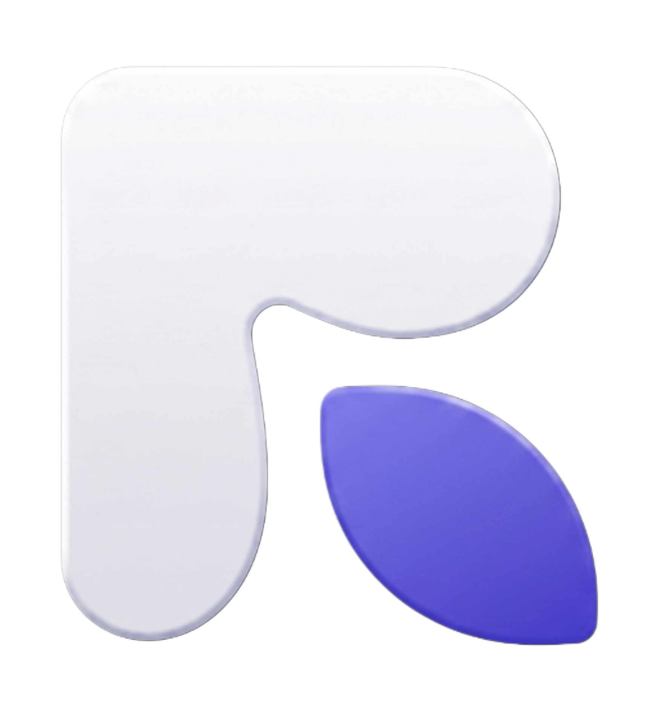

<p align="center">
  <a href="https://reicon.dev">
    
  </a>
</p>

<h1 align="center">Reicon Website</h1>

<p align="center">
  <strong>The official website for Reicon — a free, open-source icon library built with obsessive precision.</strong>
</p>

<p align="center">
  <a href="https://reicon.dev">Website</a> ·
  <a href="https://reicon.dev/icons">Browse Icons</a> ·
  <a href="https://reicon.dev/usage">Usage Guide</a> ·
  <a href="https://www.npmjs.com/package/reicon-react">npm</a>
</p>

<p align="center">
  <a href="https://www.npmjs.com/package/reicon-react"></a>
  <a href="https://www.npmjs.com/package/reicon-react"></a>
  <a href="https://github.com/dqev/reicon/blob/main/LICENSE"></a>
  <a href="https://reicon.dev/icons"></a>
  <a href="https://www.npmjs.com/package/reicon-react"></a>
</p>

---

## 📖 Table of Contents

- [Overview](#-overview)
- [Features](#-features)
- [Quick Start](#-quick-start)
- [Tech Stack](#-tech-stack)
- [Project Structure](#-project-structure)
- [Design System](#-design-system)
- [Development](#-development)
- [Build & Deployment](#-build--deployment)
- [Scripts](#-scripts)
- [SEO & Performance](#-seo--performance)
- [Contributing](#-contributing)
- [Links](#-links)
- [License](#-license)

---

## 🎯 Overview

This repository contains the source code for [reicon.dev](https://reicon.dev), a modern, performant website showcasing the Reicon icon library. Built with React 19, TypeScript, and Tailwind CSS v4, the site features:

- **2700+ handcrafted icons** with live preview and search
- **Interactive playground** for testing icon configurations
- **Comprehensive documentation** for React, Vue, and vanilla JS
- **Pixel-perfect design** with smooth animations and transitions
- **SEO-optimized** with structured data and meta tags
- **Fully responsive** with mobile-first approach

---

## ✨ Features

### Icon Library
- **2700+ Icons** — Outline and Filled weights for every icon
- **Pixel Perfect** — Every icon snaps to a 24×24 grid
- **Handcrafted** — No auto-generation, each icon is manually designed
- **Tree Shakeable** — Import only what you use
- **Zero Dependencies** — Lightweight and self-contained
- **MIT Licensed** — Free forever for personal and commercial use

### Website Features
- **Live Search** — Instant icon search with fuzzy matching
- **Interactive Playground** — Test icons with different sizes, weights, and colors
- **Copy to Clipboard** — One-click copy for React, Vue, and HTML code
- **Download Options** — SVG, PNG, and bulk download support
- **Dark Mode** — Beautiful dark theme optimized for readability
- **Smooth Scrolling** — Powered by Lenis for buttery-smooth navigation
- **Responsive Design** — Mobile-first, works on all devices

---

## 🚀 Quick Start

### Prerequisites

- Node.js 18+ and npm/yarn/pnpm
- Git

### Installation

```bash
# Clone the repository
git clone https://github.com/dqev/reicon.git
cd reicon

# Install dependencies
npm install

# Start development server
npm run dev
```

The site will be available at `http://localhost:3000`

---

## 🛠 Tech Stack

| Category | Technology |
|----------|-----------|
| **Framework** | React 19 |
| **Language** | TypeScript |
| **Build Tool** | Vite 6 |
| **Styling** | Tailwind CSS v4 |
| **Routing** | React Router v7 |
| **Smooth Scroll** | Lenis |
| **Icons** | reicon-react |
| **SEO** | React Helmet Async |
| **Analytics** | Google Analytics, PostHog |
| **Hosting** | Vercel |

---

## 📁 Project Structure

```
reicon/
├── data/                        # ⭐ Single source of truth
│   ├── icon-data.json          # Every icon (Outline + Filled) lives here
│   └── README.md               # Dataset schema & build pipeline
│
├── packages/                    # Local npm packages
│   ├── reicon-react/            # reicon-react  (React)
│   │   ├── scripts/build.cjs    # React package builder
│   │   └── dist/                # Package compilation output
│   ├── reicon-vue/              # reicon-vue    (Vue 3)
│   │   ├── scripts/build.cjs    # Vue package builder
│   │   └── dist/                # Package compilation output
│   └── reicon/                  # reicon        (vanilla JS)
│       ├── scripts/             # Vanilla JS + CDN builders
│       │   ├── build.cjs        # Main package builder
│       │   └── build-cdn.cjs    # CDN web component builder
│       └── dist/                # Package compilation output
│
├── cdn/                         # Generated CDN bundles (git-ignored)
│   ├── reicon.js / .min.js     # Main icon runtime (<re-icon>)
│   └── reicon-brands.js / .min.js
│
├── public/                      # Static assets
│   ├── favicon.ico             # Favicons
│   ├── og-image.png            # Open Graph image
│   ├── robots.txt              # SEO robots file
│   ├── sitemap.xml             # Generated sitemap
│   └── llms.txt                # LLM context file
│
├── scripts/
│   ├── generate-sitemap.mjs    # Sitemap generator
│   ├── generate-og-images.mjs  # OG image generator
│   ├── prerender-meta.mjs      # Meta tag prerendering
│   ├── ping-search-engines.mjs # Search engine notification (IndexNow)
│   ├── test-seo.mjs            # SEO audit
│   ├── setup-labels.sh         # GitHub label setup
│   └── icon-names.json         # Icon name map
│
├── src/
│   ├── components/             # Reusable components
│   │   ├── Background.tsx      # Animated WebGL background
│   │   ├── ClayButton.tsx      # Custom button component
│   │   ├── CookieConsent.tsx   # Cookie consent banner
│   │   ├── Footer.tsx          # Site footer
│   │   ├── Header.tsx          # Site header/navigation
│   │   ├── IconCard.tsx        # Icon display card (+ skeleton)
│   │   ├── Sidebar.tsx         # Icons page sidebar
│   │   ├── SmoothScroll.tsx    # Lenis scroll wrapper
│   │   └── usage/              # Usage guide components
│   │       ├── CodeBlock.tsx
│   │       ├── InstallTabs.tsx
│   │       ├── SyntaxBlock.tsx
│   │       └── TypeTable.tsx
│   │
│   ├── pages/                  # Route pages
│   │   ├── Landing.tsx         # Homepage
│   │   ├── Icons.tsx           # Icon browser
│   │   ├── IconDetail.tsx      # Individual icon page
│   │   ├── Usage.tsx           # Usage documentation
│   │   ├── Packages.tsx        # Package information
│   │   ├── Faq.tsx             # FAQ
│   │   ├── Terms.tsx / Privacy.tsx / LicensePage.tsx
│   │   └── NotFound.tsx        # 404 page
│   │
│   ├── App.tsx                 # Routes (lazy-loaded)
│   ├── main.tsx                # App entry point
│   └── index.css               # Global styles (Tailwind v4)
│
├── .github/                     # Community files, issue/PR templates
│   ├── CONTRIBUTING.md  CODE_OF_CONDUCT.md  SECURITY.md  SUPPORT.md
│   ├── CODEOWNERS  FUNDING.yml  dependabot.yml
│   └── ISSUE_TEMPLATE/ · PULL_REQUEST_TEMPLATE.md
│
├── CHANGELOG.md                 # Release history
├── LICENSE                      # MIT
├── index.html                   # Vite HTML entry point
├── package.json                 # Dependencies & scripts
├── tsconfig.json                # TypeScript config
├── vite.config.ts               # Vite configuration
├── vercel.json                  # Vercel deploy config
└── README.md                    # This file
```

> **Note:** `packages/` and `cdn/` are generated from `data/icon-data.json`.
> While `cdn/` is git-ignored, `packages/` is committed and tracked. Build them with
> `npm run build:packages`. Never edit those outputs by hand.

---

## 🎨 Design System

### Color Palette

```css
/* Primary Colors */
--bg-primary: #09090b;        /* Main background */
--bg-secondary: #0e0e10;      /* Card backgrounds */
--text-primary: #ffffff;      /* Primary text */
--text-secondary: rgba(255, 255, 255, 0.6);  /* Secondary text */
--text-tertiary: rgba(255, 255, 255, 0.45);  /* Tertiary text */

/* Accent Colors */
--accent-primary: #6C5CE7;    /* Purple accent */
--accent-hover: #5a4bd1;      /* Purple hover state */
--success: #7fff7f;           /* Success green */

/* Border & Overlay */
--border-subtle: rgba(255, 255, 255, 0.06);
--border-medium: rgba(255, 255, 255, 0.12);
--overlay-light: rgba(255, 255, 255, 0.04);
--overlay-medium: rgba(255, 255, 255, 0.08);
```

### Typography

```css
/* Font Family */
--font-sans: "DM Sans", sans-serif;
--font-serif: "DM Sans", sans-serif;  /* Used for headings with font-weight: 600 */

/* Font Sizes */
--text-xs: 11px;
--text-sm: 13px;
--text-base: 14px;
--text-md: 15px;
--text-lg: 18px;
--heading-sm: clamp(24px, 3.2vw, 42px);
--heading-md: clamp(26px, 3.6vw, 46px);
--heading-lg: clamp(30px, 6.2vw, 76px);

/* Font Weights */
--weight-normal: 400;
--weight-medium: 500;
--weight-semibold: 600;
--weight-bold: 700;
```

### Spacing Scale

```css
/* Spacing (based on 4px grid) */
--space-1: 4px;
--space-2: 8px;
--space-3: 12px;
--space-4: 16px;
--space-5: 20px;
--space-6: 24px;
--space-8: 32px;
--space-10: 40px;
--space-12: 48px;
--space-14: 56px;
--space-16: 64px;
```

### Border Radius

```css
--radius-sm: 8px;
--radius-md: 12px;
--radius-lg: 14px;
--radius-xl: 18px;
--radius-full: 9999px;
```

### Components

#### Clay Button

A custom button component with a clay/neumorphic design:

```tsx
import ClayButton from './components/ClayButton';

// Variants: primary, secondary, accent
// Sizes: sm, md

<ClayButton variant="primary" size="md" to="/icons">
  Browse Icons
</ClayButton>
```

**Variants:**
- `primary` — White background, dark text
- `secondary` — Glass/transparent with border
- `accent` — Purple gradient background

#### Icon Card

Displays individual icons with hover effects:

```tsx
import IconCard from './components/IconCard';

<IconCard 
  name="home" 
  weight="outline" 
  size={24} 
/>
```

#### Feature Card

Displays feature information with icon:

```tsx
import FeatureCard from './components/FeatureCard';

<FeatureCard 
  icon={<Icon />}
  title="Pixel Perfect"
  description="Every icon snaps to a 24×24 grid"
/>
```

### Animations

#### Orbit Animation

Used for the icon showcase section:

```css
@keyframes orbit {
  from { transform: rotate(0deg); }
  to { transform: rotate(360deg); }
}

.animate-orbit-slow { animation: orbit 60s linear infinite; }
.animate-orbit-mid { animation: orbit-reverse 80s linear infinite; }
.animate-orbit-fast { animation: orbit 100s linear infinite; }
```

#### Marquee Animation

Used for scrolling icon rows:

```css
@keyframes marquee {
  from { transform: translateX(0); }
  to { transform: translateX(-50%); }
}

.animate-marquee { animation: marquee linear infinite; }
```

#### Fade Up Animation

Used for scroll-reveal sections:

```css
@keyframes fadeUp {
  to {
    opacity: 1;
    transform: translateY(0);
  }
}

.reveal {
  opacity: 0;
  transform: translateY(18px);
  transition: opacity 0.52s ease, transform 0.52s ease;
}

.revealed {
  opacity: 1;
  transform: none;
}
```

### Responsive Breakpoints

```css
/* Tailwind CSS breakpoints */
sm: 640px   /* Small devices */
md: 768px   /* Medium devices */
lg: 1024px  /* Large devices */
xl: 1280px  /* Extra large devices */
2xl: 1536px /* 2X large devices */
```

---

## 💻 Development

### Environment Variables

Create a `.env` file in the root directory:

```env
# Analytics (optional)
VITE_GA_ID=G-XXXXXXXXXX
VITE_POSTHOG_KEY=phc_xxxxxxxxxxxxx
VITE_POSTHOG_HOST=https://app.posthog.com

# API Keys (if needed)
VITE_API_URL=https://api.reicon.dev
```

### Development Server

```bash
# Start dev server on port 3000
npm run dev

# Start with custom port
npm run dev -- --port 3001

# Start with network access
npm run dev -- --host
```

### Code Quality

```bash
# Type checking
npm run lint

# Format code (if using Prettier)
npm run format
```

### Adding New Icons

All icons live in **`data/icon-data.json`** — the single source of truth for the
packages, the CDN bundle, and the website.

1. Add the icon to `data/icon-data.json` under the right category, with `Outline`
   and `Filled` weights (see [`data/README.md`](data/README.md) for the schema).
2. Rebuild the packages and CDN: `npm run build:packages`
3. Verify on the dev site: `npm run dev`
4. (For production) regenerate the sitemap and OG images: `npm run sitemap` and `npm run build:og`

> Don't edit anything in `packages/` or `cdn/` — those are generated.

### Adding New Pages

1. Create page component in `src/pages/`
2. Add route in `src/App.tsx`
3. Update sitemap generator in `scripts/generate-sitemap.mjs`
4. Add navigation links in `Header.tsx` and `Footer.tsx`

---

## 🏗 Build & Deployment

### Production Build

```bash
# Full production build
npm run build:full

# This runs:
# 1. Generate sitemap
# 2. Build with Vite
# 3. Prerender meta tags
# 4. Generate OG images
# 5. Ping search engines
```

### Build Steps Breakdown

```bash
# 1. Generate sitemap only
npm run sitemap

# 2. Standard build (sitemap + vite build + prerender)
npm run build

# 3. Generate OG images
npm run build:og

# 4. Ping search engines
npm run ping

# 5. Preview production build
npm run preview

# 6. Clean build directory
npm run clean
```

### Deployment

The site is configured for Vercel deployment:

```bash
# Deploy to Vercel
vercel

# Deploy to production
vercel --prod
```

**Vercel Configuration:**
- Build Command: `npm run build`
- Output Directory: `dist`
- Install Command: `npm install`
- Node Version: 18.x

---

## 📜 Scripts

| Script | Description |
|--------|-------------|
| `npm run dev` | Start development server on port 3000 |
| `npm run build` | Build for production (includes sitemap & prerender) |
| `npm run build:og` | Generate Open Graph images for all icons |
| `npm run build:full` | Full build with OG images and search engine ping |
| `npm run build:react` | Build the `reicon-react` package from `data/icon-data.json` |
| `npm run build:vue` | Build the `reicon-vue` package |
| `npm run build:js` | Build the `reicon` (vanilla) package |
| `npm run build:cdn` | Build the CDN bundle (`cdn/reicon.js`) |
| `npm run build:packages` | Build all packages + the CDN bundle |
| `npm run preview` | Preview production build locally |
| `npm run sitemap` | Generate sitemap.xml |
| `npm run ping` | Notify search engines of sitemap updates |
| `npm run clean` | Remove dist directory |
| `npm run lint` | Run TypeScript type checking |

---

## 🔍 SEO & Performance

### SEO Features

- **Structured Data** — JSON-LD for SoftwareApplication, Organization, WebSite, FAQPage, BreadcrumbList
- **Meta Tags** — Complete Open Graph and Twitter Card meta tags
- **Sitemap** — Auto-generated XML sitemap with 50,000 URL limit per file
- **Robots.txt** — Configured for optimal crawling
- **Canonical URLs** — Proper canonical tags on all pages
- **Alt Text** — All images have descriptive alt text
- **Semantic HTML** — Proper heading hierarchy and ARIA labels
- **LLM Context** — `/llms.txt` and `/llms-full.txt` for AI discoverability

### Performance Optimizations

- **Code Splitting** — Route-based code splitting with React Router
- **Tree Shaking** — Only used icons are bundled
- **Image Optimization** — Optimized PNG and SVG assets
- **Font Loading** — `display=swap` for web fonts
- **Lazy Loading** — Images and components lazy loaded
- **Preconnect** — DNS prefetch and preconnect for external resources
- **Minification** — CSS and JS minified in production
- **Compression** — Gzip/Brotli compression enabled

### Lighthouse Scores (Target)

- **Performance:** 95+
- **Accessibility:** 100
- **Best Practices:** 100
- **SEO:** 100

---

## 🤝 Contributing

Contributions are welcome! Please follow these guidelines:

1. **Fork the repository**
2. **Create a feature branch:** `git checkout -b feature/amazing-feature`
3. **Commit your changes:** `git commit -m 'Add amazing feature'`
4. **Push to the branch:** `git push origin feature/amazing-feature`
5. **Open a Pull Request**

### Contribution Guidelines

- Follow the existing code style and conventions
- Write meaningful commit messages
- Test your changes thoroughly
- Update documentation if needed
- Ensure all TypeScript types are correct
- Keep components small and focused

---

## 🔗 Links

- **Website:** [reicon.dev](https://reicon.dev)
- **Icon Browser:** [reicon.dev/icons](https://reicon.dev/icons)
- **Documentation:** [reicon.dev/usage](https://reicon.dev/usage)
- **npm Package:** [npmjs.com/package/reicon-react](https://www.npmjs.com/package/reicon-react)
- **GitHub:** [github.com/dqev/reicon](https://github.com/dqev/reicon)
- **LinkedIn:** [linkedin.com/company/reicon-dev](https://www.linkedin.com/company/reicon-dev)
- **Bluesky:** [bsky.app/profile/reicondev.bsky.social](https://bsky.app/profile/reicondev.bsky.social)

---

## 💖 Sponsor

Reicon is free and open source, maintained in the open. If it saves you time,
consider sponsoring its development:

- **GitHub Sponsors:** [github.com/sponsors/dqev](https://github.com/sponsors/dqev)
- **Buy Me a Coffee:** [buymeacoffee.com/dev3](https://www.buymeacoffee.com/dev3)

Every bit helps keep the icons coming. Thank you! 🙏

---

## 📄 License

MIT License - Copyright (c) 2024 [Dev Chauhan](https://devchauhan.in)

Permission is hereby granted, free of charge, to any person obtaining a copy of this software and associated documentation files (the "Software"), to deal in the Software without restriction, including without limitation the rights to use, copy, modify, merge, publish, distribute, sublicense, and/or sell copies of the Software, and to permit persons to whom the Software is furnished to do so, subject to the following conditions:

The above copyright notice and this permission notice shall be included in all copies or substantial portions of the Software.

THE SOFTWARE IS PROVIDED "AS IS", WITHOUT WARRANTY OF ANY KIND, EXPRESS OR IMPLIED, INCLUDING BUT NOT LIMITED TO THE WARRANTIES OF MERCHANTABILITY, FITNESS FOR A PARTICULAR PURPOSE AND NONINFRINGEMENT. IN NO EVENT SHALL THE AUTHORS OR COPYRIGHT HOLDERS BE LIABLE FOR ANY CLAIM, DAMAGES OR OTHER LIABILITY, WHETHER IN AN ACTION OF CONTRACT, TORT OR OTHERWISE, ARISING FROM, OUT OF OR IN CONNECTION WITH THE SOFTWARE OR THE USE OR OTHER DEALINGS IN THE SOFTWARE.

---

<p align="center">
  <strong>Built with ❤️ by <a href="https://devchauhan.in">Dev Chauhan</a></strong>
</p>

<p align="center">
  <a href="https://reicon.dev">
    
  </a>
</p>